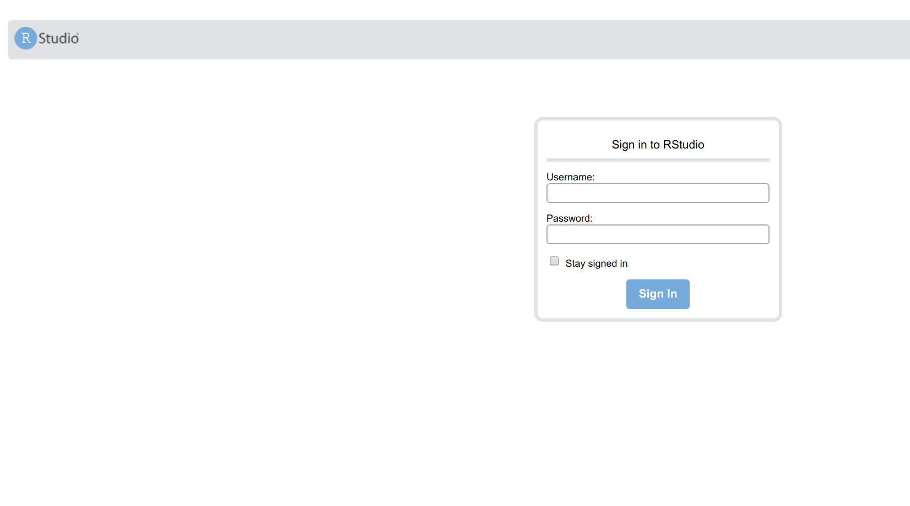
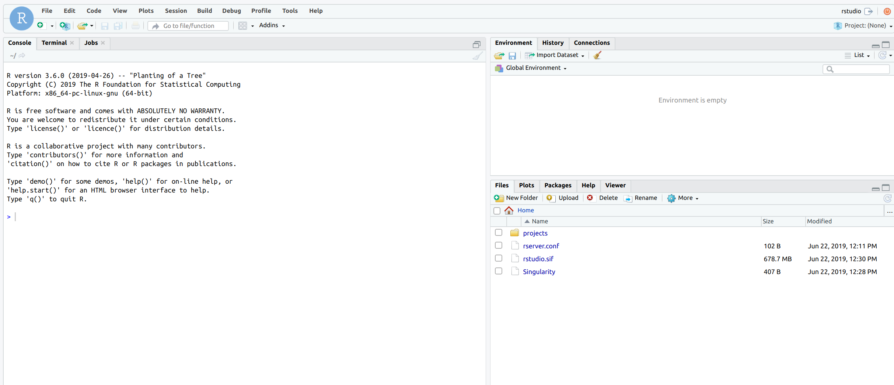

# Rstudio Simple

This is an example that uses [singularity-compose](https://www.github.com/singularityhub/singularity-compose) to bring up an rstudio + nginx instance.
We use `rocker/tidyverse:3.6.0` as a base image. We bind [rstudio](rstudio)
to `/home/rstudio` and include a projects directory with an example
project.


## Setup

We take a basic approach here to create a group of users `rstudio-users`
that we add a user defined in the `%post` in the [Singularity recipe](rstudio/Singularity). You should definitely change this! Keep in mind that user `rstudio`
is already added to the base container, and we do this so that `/home/rstudio`
is bound and includes the example project.

It's recommended to take a look
[here](https://docs.rstudio.com/ide/server-pro/authenticating-users.html#restricting-access-to-specific-users) to explore the different authentication methods
that are available. We edit the `/etc/rstudio/rserver.conf` (bound to the
container from our local folder) but you could also set up Google login or similar.

## Singularity Compose

First, make sure you have it installed.

```bash
$ pip install singularity-compose --user
```

Clone the repository

```bash
$ git clone https://www.github.com/singularityhub/singularity-compose-examples
$ cd singularity-compose-examples/rstudio-simple
```

### Build

Build the containers. The current recipe has fakeroot (part of [release candidate 3.3.0](https://github.com/sylabs/singularity/releases/tag/v3.3.0-rc.1)
and if you haven't installed it, you can remove it and use sudo.

```bash
$ singularity-compose build
```

Once you've built, you should see the containers `nginx.sif` and `rstudio.sif` in
their respective folders:

```bash
$ ls nginx/
cache  nginx.conf  nginx.sif  run  Singularity
$ ls rstudio/
projects  rstudio.sif  Singularity
```

### Up

You can bring up the containers as instances. Since we expose ports, this requires
sudo.

```bash
$ singularity-compose up
Creating rstudio
Creating nginx
```

Check to see them running:

```bash
$ singularity-compose ps
INSTANCES  NAME PID     IMAGE
1         nginx	15679	nginx.sif
2       rstudio	15463	rstudio.sif
```

Open your browser to [http://127.0.0.1](http://127.0.0.1) and it will redirect
you to sign in.



Don't forget the password that you defined in your recipe! When you log in,
 you'll see rstudio's home, which includes the project folder with an example
project.



If you change the username to something
else, remember that we see the $HOME of the username, so we won't
see the example projects that are bound at `/home/rstudio`.


### Shell

If you need to look inside the container or debug, you can use shell:

```bash
$ singularity-compose shell rstudio
> cat /etc/hosts
10.22.0.3	nginx
10.22.0.2	rstudio
127.0.0.1	localhost

# The following lines are desirable for IPv6 capable hosts
::1     ip6-localhost ip6-loopback
fe00::0 ip6-localnet
ff00::0 ip6-mcastprefix
ff02::1 ip6-allnodes
ff02::2 ip6-allrouters
```


## Down
And of course when you finish, don't forget to bring the instances down.

```bash
$ singularity-compose down
```

## Next Steps

What to do now? Try installing a package!

```R
install.packages("lubridate")
```

And at this point, you are free to install packages and develop in the mounted
home. Since it's bound to the host, you shouldn't lose any work to bring the
container up and down.

## Updates

Currently, Singularity doesn't do anything special to provide a resolv.conf
that works. In the meantime, we are binding one with Google nameservers
from the host. If this is a consistent issue, then singularity-compose 
will try to handle it automatically.

